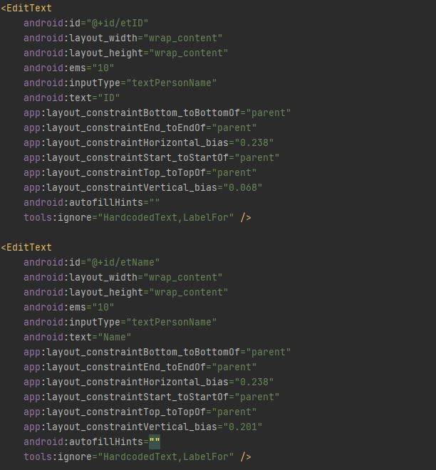
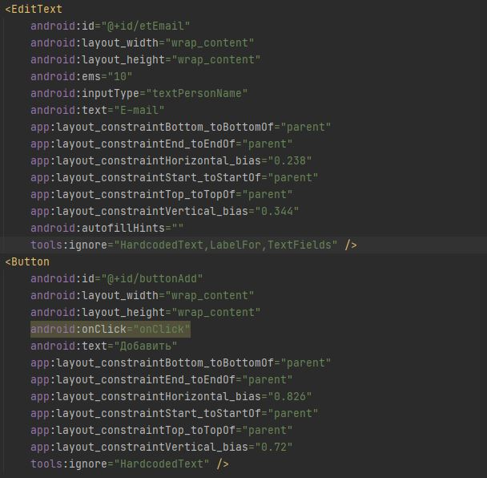
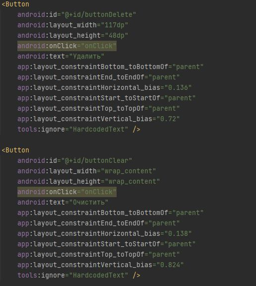
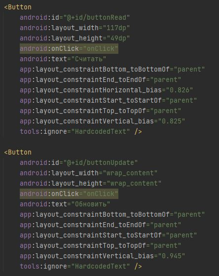
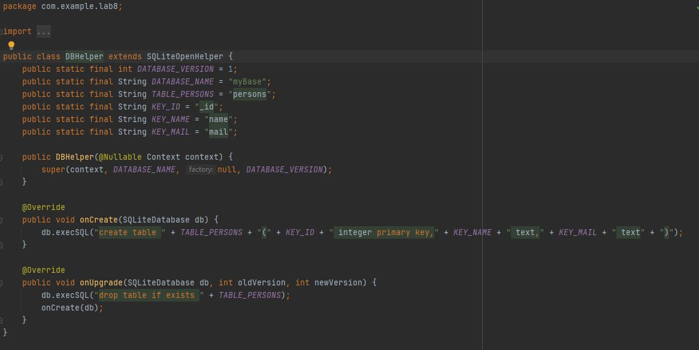
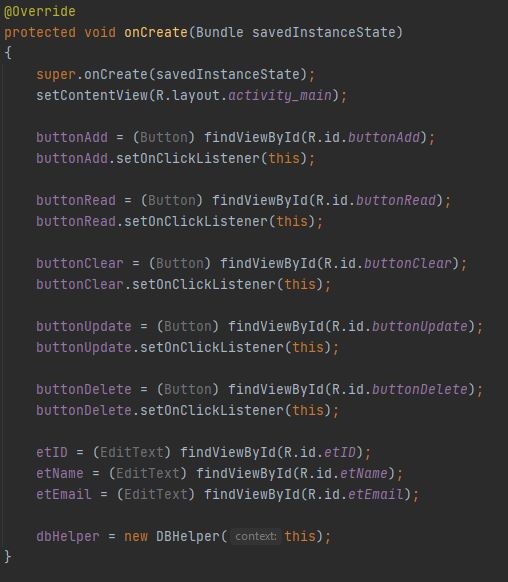
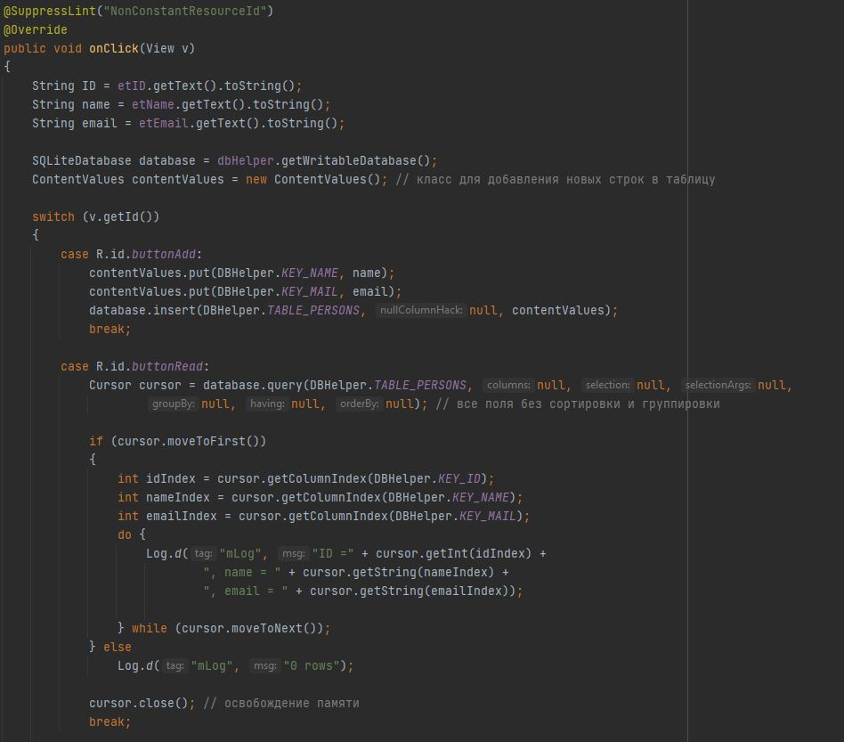
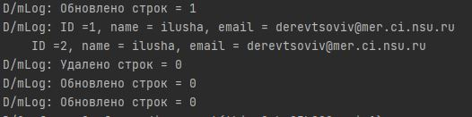

# lab8mob

Создаем проект и добавляем туда 3 Edittext и 5 кнопок.

</img>

</img>

</img>

</img>

Добавляем класс DBHelper

</img>

MainActivity

</img>

</img>

проверяем работу

</img>

</img>
